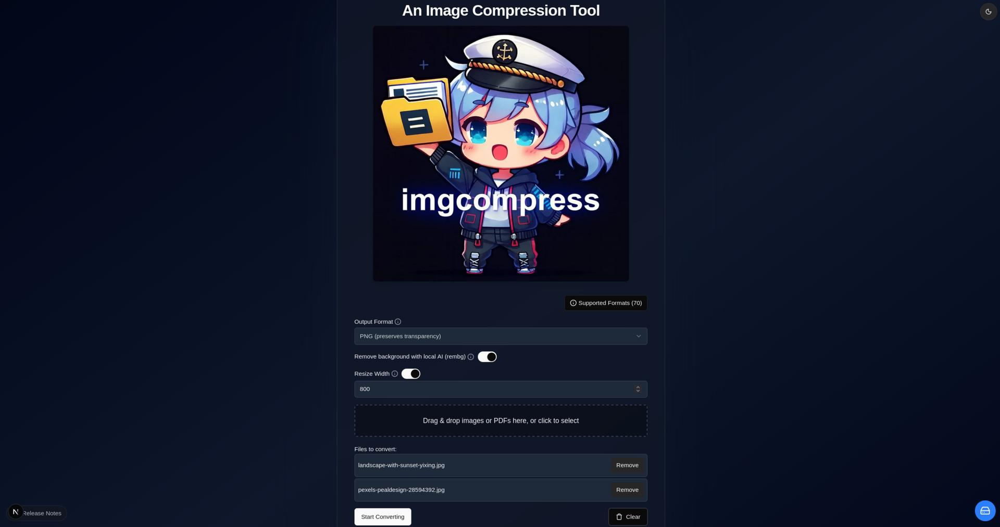
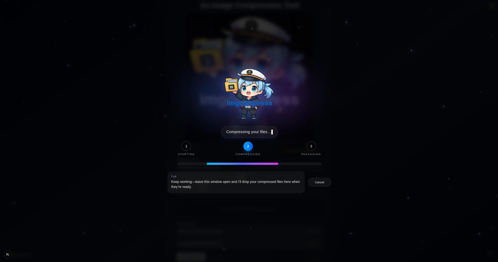

# imgcompress - Privacy-First Image Optimizer: Compress, Convert & AI Background Removal (Docker)

[](https://hub.docker.com/r/karimz1/imgcompress)
[](https://hub.docker.com/r/karimz1/imgcompress)
[](https://hub.docker.com/r/karimz1/imgcompress/tags)
[](https://github.com/karimz1/imgcompress/releases)
[](https://github.com/karimz1/imgcompress/blob/main/LICENSE)
[](https://paypal.me/KarimZouine972)


**A self-hosted Docker image compression and conversion tool** with local AI background removal. Process unlimited images offline: no cloud uploads, no subscriptions, no per-image limits.

**Perfect for:** photographers managing large galleries, developers optimizing web assets, privacy-conscious users, and anyone needing a **free TinyPNG/Squoosh alternative** that runs entirely on your hardware.

### 🛡️ Why Choose imgcompress?

- **🔒 Privacy-First**: Your images never leave your network. Process sensitive documents, personal photos, and confidential materials with complete data sovereignty.
- **💰 Unlimited Free Usage**: No subscriptions, API keys, or per-image credits. Compress millions of images at zero cost: a true alternative to expensive cloud services.
- **🌐 Universal Format Support**: 70+ formats including HEIC, WebP, PSD, EPS, TIFF, and PDF ingestion. One tool for all your conversion needs.
- **🏠 Self-Hosted Control**: Docker-based deployment for home labs, NAS devices, and enterprise environments. Full control over your image processing pipeline.
- **🤖 Local AI Background Removal**: Remove backgrounds using on-device AI models. No external API calls, no data leakage.


---

### 🧠 New Local AI Background Removal (Preview)

| Original Image | Background Removed (Local AI) |
|----------------|-------------------------------|
|  |  |


> Processed locally using an embedded AI model no external services involved. Now integrated in imgcompress.

📸 **Source of original image:**  
[Landscape with sunset in Yixing (Freepik)](https://www.freepik.com/free-photo/landscape-with-sunset-yixing_1287284.htm) — used for demonstration purposes.

🧠 **AI background removal powered internally by** [rembg](https://github.com/danielgatis/rembg)  
(rembg is used locally inside the container of imgcompress. No data is sent externally for privacy.)

___

### 🖥️ Web UI Preview

| Step | Screenshot | Description |
|-----:|------------|-------------|
| **1** | <a href="images/ui-example/1.jpg"></a> | **Upload & Configure**<br/>Drag & drop images or PDFs, choose format, configure options. |
| **2** | <a href="images/ui-example/2.jpg"></a> | **Processing**<br/>Images are processed locally with live progress feedback. |
| **3** | <a href="images/ui-example/3.jpg"></a> | **Download Results**<br/>Download files individually or as a ZIP archive. |

<sub>💡 Click any screenshot to view it in full resolution.</sub>

___
  

- [imgcompress — Privacy-First Image Optimizer: Compress, Convert & AI Background Removal](#imgcompress---privacy-first-image-optimizer-compress-convert--ai-background-removal-docker)
  - [🚀 Quick Start](#-quick-start)
    - [Using `docker compose`](#using-docker-compose)
    - [Using `docker run`](#using-docker-run)
      - [🧼 Minimal Mode: Hide the Mascot](#-minimal-mode-hide-the-mascot)
  - [🔄 Updating imgcompress (get the latest stable release)](#-updating-imgcompress-get-the-latest-stable-release)
    - [Using `docker compose`](#using-docker-compose-1)
    - [Using `docker run`](#using-docker-run-1)
  - [❓ Why imgcompress?](#-why-imgcompress)
  - [✨ Core Features](#-core-features)
  - [💼 Common Use Cases](#-common-use-cases)
  - [**🔖 Choosing Your Version**](#-choosing-your-version)
    - [**Stable (``latest``)**](#stable-latest)
    - [**Pinned Release (for example: `0.2.8`)**](#pinned-release-for-example-028)
    - [**Nightly (``nightly``)**](#nightly-nightly)
  - [🛠️ Scriptable CLI — Advanced Guide](#️-scriptable-cli--advanced-guide)
    - [🔀 CLI vs Web Mode](#-cli-vs-web-mode)
      - [Help](#help)
        - [Global help](#global-help)
        - [CLI help](#cli-help)
  - [✅ Supported Image Formats](#-supported-image-formats)
    - [🗂️ Supported (not yet verified)](#️-supported-not-yet-verified)
  - [🖥️ Supported Platforms](#️-supported-platforms)
  - [🔒 Privacy \& Security](#-privacy--security)
  - [🤝 Contribute](#-contribute)
  - [❤️ Donate to Support Development](#️-donate-to-support-development)
  - [📓 Release Notes](#-release-notes)
  - [📝 License](#-license)


## 🚀 Quick Start

### Using `docker compose`

```yaml
services:
  imgcompress:
    image: karimz1/imgcompress:latest
    container_name: imgcompress
    restart: always
    ports:
      - "3001:5000"                     # HOST:CONTAINER — change 3001 if needed
    environment:
      - DISABLE_LOGO=true               # Optional: disable mascot
      - DISABLE_STORAGE_MANAGEMENT=true # Optional: disable the Storage Management
````
Start:
```bash
docker compose up -d 
```

Then open:

👉 **[http://localhost:3001](http://localhost:3001/)**


### Using `docker run`

````bash
docker run -d --name imgcompress -p 3001:5000 karimz1/imgcompress:latest
````

#### 🧼 Minimal Mode: Hide the Mascot

Prefer a cleaner UI?

```` bash
docker run -d --name imgcompress -p 3001:5000 -e DISABLE_LOGO=true karimz1/imgcompress:latest
````
___

## 🔄 Updating imgcompress (get the latest stable release)

### Using `docker compose`
```bash
docker compose pull
docker compose up -d --force-recreate
```

### Using `docker run`

```bash
docker pull karimz1/imgcompress:latest
docker stop imgcompress
docker rm imgcompress
docker run -d --name imgcompress -p 3001:5000 karimz1/imgcompress:latest
```
> **Open imgcompress:** **[http://localhost:3001](http://localhost:3001/)**


⬅️ Back to: [**Quick Start (`docker compose`)**](#using-docker-compose)
 or [**Quick Start (`docker run`)**](#using-docker-run)


___

## ❓ Why imgcompress?

Tired of **uploading sensitive images to cloud services**? Frustrated by **per-image pricing** on tools like TinyPNG? Need to **batch-process thousands of HEIC files** without expensive software?

**imgcompress solves this.** I'm **Karim Zouine**, and I built this as a **zero-cost, privacy-first alternative** to cloud-based image tools.

**What makes it different:**
- **No cloud uploads**: Your images stay on your hardware. Critical for NDAs, medical imagery, or personal photos.
- **No usage limits**: Process 10 images or 10 million. No subscriptions, no API quotas.
- **All-in-one**: Compression, conversion (HEIC→JPG, PNG→WebP, PDF→images), resizing, and AI background removal in a single tool.
- **Production-ready**: Multi-core processing, CLI automation, Docker isolation, and cross-platform support (ARM64/AMD64).

___

## ✨ Core Features

### 📱 HEIC/HEIF to JPG Converter
Instantly convert Apple HEIC/HEIF images to JPG, PNG, WebP, or any supported format. No more compatibility issues when sharing iPhone photos.

### 🤖 AI-Powered Background Removal
Remove image backgrounds using local AI models (powered by rembg). Runs 100% offline: no API calls, no external services, complete privacy.

### 📰 PDF to Image Converter
Upload multi-page PDFs and automatically extract/rasterize every page as individual images. Perfect for document processing workflows.

### 🖼️ Universal Image Conversion
Supports 70+ formats: HEIC, JPG, PNG, PSD, TIFF, EPS, ICO, WebP, GIF, BMP, and more. One tool for all conversion needs.

### ⚙️ Granular Quality Control
Set JPEG quality (1-100), enable PNG lossless mode, specify target dimensions, and fine-tune output settings.

### 🚀 Multi-Core Batch Processing
Automatically utilizes all CPU cores for parallel processing. Compress thousands of images in minutes, not hours.

### 🛠️ CLI Automation for CI/CD
Scriptable command-line interface with `--json-output` for logs. Integrate into build pipelines, cronjobs, or automated workflows.

### 📦 Cross-Platform Docker Image
Runs on Linux (x86-64, ARM64), macOS (Intel/Apple Silicon), Windows (WSL2), Raspberry Pi 4+, and AWS Graviton.

___

## 💼 Common Use Cases

### For Photographers
- **Batch compress wedding photos**: Reduce file sizes by 70% without visible quality loss before client delivery.
- **Convert RAW to Web formats**: Process thousands of images for portfolio websites or online galleries.
- **HEIC compatibility**: Convert iPhone photos to JPG for universal client compatibility.

### For Developers
- **Optimize web assets**: Compress images for faster page loads and better Core Web Vitals scores.
- **CI/CD integration**: Automate image optimization in build pipelines using the CLI.
- **Thumbnail generation**: Batch-resize product images for e-commerce platforms.

### For Privacy-Conscious Users
- **Process sensitive documents**: Compress legal, medical, or confidential images without cloud uploads.
- **Family photo management**: Organize and optimize personal galleries on your NAS or home server.
- **Offline workflows**: Run completely air-gapped for maximum data security.

### For Enterprises
- **GDPR/HIPAA compliance**: Keep image processing on-premises to meet regulatory requirements.
- **Cost optimization**: Eliminate per-image fees from cloud services. Process unlimited images for infrastructure cost only.
- **Custom workflows**: Deploy on internal infrastructure with full control over processing logic.

____  

## **🔖 Choosing Your Version**

imgcompress provides **three tags**, depending on your needs:

| **Version**        | **Tag** | **What’s Included**           | **Best For**                     |
| ------------------ | ------- | ----------------------------- | -------------------------------- |
| **Stable**         | ``latest``  | Fully tested release          | Most users — recommended         |
| **Pinned Release** | ``X.Y.Z``   | Exact version, never changes | Reproducible deployments, historic versions |
| **Nightly**        | ``nightly`` | Latest changes & dependency bumps | Testing new features (may break) |


[See all available tags](https://hub.docker.com/r/karimz1/imgcompress/tags)

---

### **Stable (``latest``)**
The safest and most reliable choice.  
Every latest release passes **QA checks by the author (Karim Zouine)** before publication.

### **Pinned Release (for example: `0.2.8`)**
A frozen version that **never updates**.  
Ideal for locked-down deployments or staying on a version you trust.

### **Nightly (``nightly``)**
Includes the newest changes and dependency updates.  
⚠️ May include breaking changes — think of it as a **public beta**.


## 🛠️ Scriptable CLI — Advanced Guide

Need to crunch **thousands or millions** of images? Use the CLI:

**Single File**

``` bash
docker run --rm \
  -v "$(pwd):/container/images" \
  -v "$(pwd)/converted:/container/converted" \
  karimz1/imgcompress:latest \
  cli \
  /container/images/example.jpg /container/converted --quality 80 --width 1920
```

**Folder**

``` bash
docker run --rm \
  -v "$(pwd):/container/images" \
  -v "$(pwd)/converted:/container/converted" \
  karimz1/imgcompress:latest \
  cli \
  /container/images /container/converted --quality 85 --width 800
```

**Background Removal (AI)**

``` bash
docker run --rm \
  -v "$(pwd):/container/images" \
  -v "$(pwd)/converted:/container/converted" \
  karimz1/imgcompress:latest \
  cli \
  /container/images/photo.jpg /container/converted \
  --format png --remove-background
```

**How it works**

1. **📁 Local directory mapping**
   - **Input:** original images
   - **Output:** optimised images
2. **⚙️ Process parameters**
   - `--quality` (1–100, default 85)
   - `--width` (optional resize)
   - `--format` (jpeg or png, default jpeg)
   - `--remove-background` (AI background removal, requires `--format png`)
   - `--debug` (verbose logs)
   - `--json-output` (machine-friendly logs for CI)


---

### 🔀 CLI vs Web Mode

imgcompress supports **two execution modes**:

| Mode | Description | When to use | 
|----|----|----|
| `web` | This is the default even without giving a mode. Starts the Web UI | Interactive usage, drag & drop |
| `cli` | Runs the image processor | Automation, scripts, CI/CD |


#### Help

##### Global help
``` bash
docker run --rm karimz1/imgcompress:latest --help
```

##### CLI help
``` bash
docker run --rm karimz1/imgcompress:latest cli --help
```

___

## ✅ Supported Image Formats

✔ Verified in CI

See function: def verified_image_formats()

Current list (as of 01.12.2025):
````
.heic .heif .png .jpg .jpeg .ico .eps .psd .pdf
````


### 🗂️ Supported (not yet verified)</summary>

imgcompress supports all formats provided by Pillow.
[Full list](https://pillow.readthedocs.io/en/stable/handbook/image-file-formats.html#) but keep in mind not all have been tested in the suite ***yet*** but I'm on it: [Improvement: Test matrix over all Pillow-supported formats #312](https://github.com/karimz1/imgcompress/issues/312)  

Need a format that’s missing or failing?
[Open an issue](https://github.com/karimz1/imgcompress/issues) with a sample file and short description. Happy to expand coverage!

------

## 🖥️ Supported Platforms

| Docker image platform | Typical host | Status |
|-----------------------|--------------|:------:|
| **linux/amd64**       | x86-64 Linux, Windows (WSL 2) | ✅ |
| **linux/arm64**       | Apple Silicon, Raspberry Pi 4+, AWS Graviton | ✅ |

> **Windows desktop:** Runs via Docker Desktop + WSL 2 (no native Windows-container build needed).

<details>
<summary>💡 Testing note (click to expand)</summary>

All platforms above are built and run in CI with QEMU multi-arch emulation and a GitHub Actions matrix.  
That means the images pass automated tests, but not every architecture has been manually tried on physical hardware.

</details>


------

## 🔒 Privacy & Security

- **100% local processing**: No uploads, no telemetry.
- **No telemetry, no tracking**: The container has zero outbound analytics.
- **Open-source and auditable**
- **Run fully offline**
- **Docker isolation**: Run with read-only volumes or network-disabled mode for extra peace of mind.

---

## 🤝 Contribute

Want to make imgcompress even better?

1. ⭐ Star the repo to support the project  
2. **Fork → Branch → PR**: Developers are welcome to contribute!  
3. Browse `good first issue` or `help wanted` labels for starter tasks  
4. File bugs or feature requests on the [issue tracker](https://github.com/karimz1/imgcompress/issues)

Thank you for supporting open source ❤️

---

## ❤️ Donate to Support Development

If imgcompress saves you time, consider donating.  
Every contribution helps support development, testing, and ongoing maintenance.

[](https://paypal.me/KarimZouine972)

*(Completely optional, and always appreciated.)*

---

## 📓 Release Notes

See the full release history in [frontend/public/release-notes.md](/frontend/public/release-notes.md).

## 📝 License

This project is licensed under the GNU General Public License v3.0 (GPL-3.0).
See the [LICENSE](/LICENSE) file for details.


