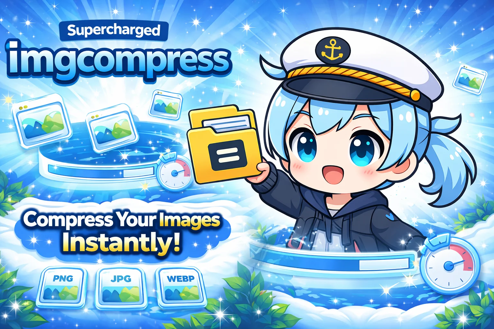

# ImgCompress: The Private, Self-Hosted Image Converter
## 100% Local Compression, AI Background Removal & Format Conversion (Docker)

<div align="center"> 


[](https://hub.docker.com/r/karimz1/imgcompress)
[](https://hub.docker.com/r/karimz1/imgcompress)
[](https://github.com/karimz1/imgcompress/blob/main/LICENSE)
[](https://imgcompress.karimzouine.com/)

**ImgCompress** is a private and easy way to shrink thousands of images, remove backgrounds with AI, and convert files like PSD or HEIC. Everything runs 100% on your own hardware with **zero cloud uploads** and no tracking.

### Instant, Powerful Web UI
*Full control at your fingertips. No setup, no tracking, 100% offline.*


</div>

## Key Advantages

*   **Privacy-First Architecture**: Designed for internal corporate networks and air-gapped environments. 
*   **Local AI Background Removal**: Professional-grade cutouts powered by local **u2net** models—zero data leaves your server.
*   **Universal Format Support**: Convert between 70+ formats including **AVIF, WebP, HEIC, PSD, and PDF**.
*   **Professional PDF Generation**: Effortlessly convert images into native, structured PDFs with intelligent A4 pagination, "Smart Splitting" for long captures, and customizable layout controls.
*   **High Performance**: Multi-core batch processing for lightning-fast optimization.

## AI Demo: Professional Background Removal
| Original Image | Background Removed (Local AI) |
| :--- | :--- |
|  |  |

## Quick Start

1.  **Deploy via Docker**:
    ```bash
    docker run -d -p 3001:5000 --name imgcompress karimz1/imgcompress:latest
    ```
2.  **Access the Dashboard**: Open `http://localhost:3001` in your browser.
3.  **Read the Guides**: [Full Installation & Configuration &rarr;](https://imgcompress.karimzouine.com/installation/)

## Support & Community

*   **[Sponsorship & Honor Roll &rarr;](https://imgcompress.karimzouine.com/hall-of-fame/)**: Support independent development.
*   **[Contributing &rarr;](https://imgcompress.karimzouine.com/contributing/)**: Join the open-source community.

**License**: [GPL-3.0](LICENSE) | **Author**: [Karim Zouine](https://www.karimzouine.com) | **Image & Library Credits**: [View All Credits](https://imgcompress.karimzouine.com/credits/)
