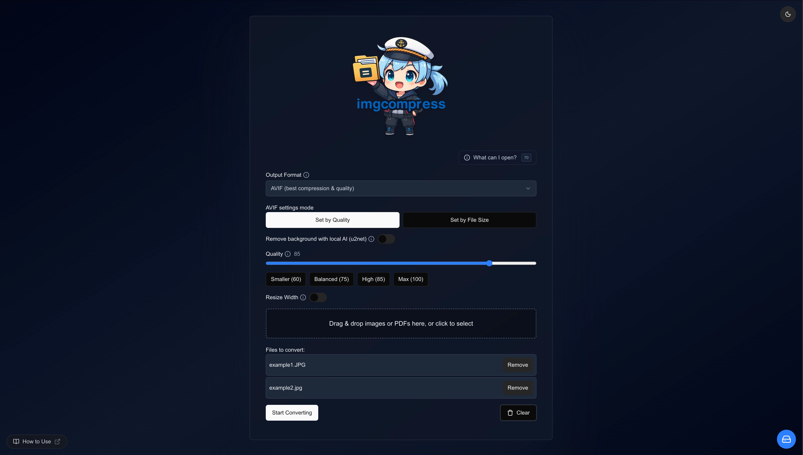
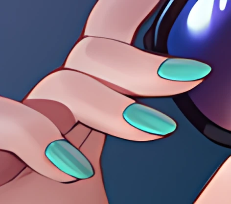
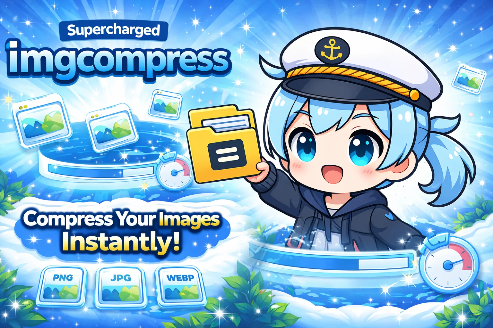
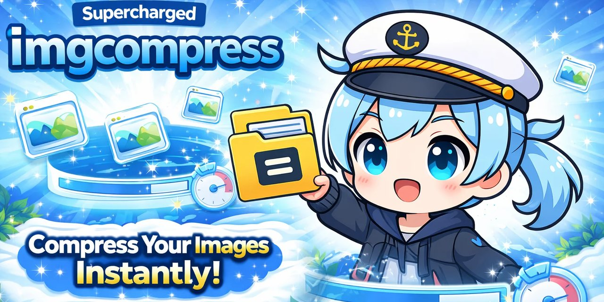
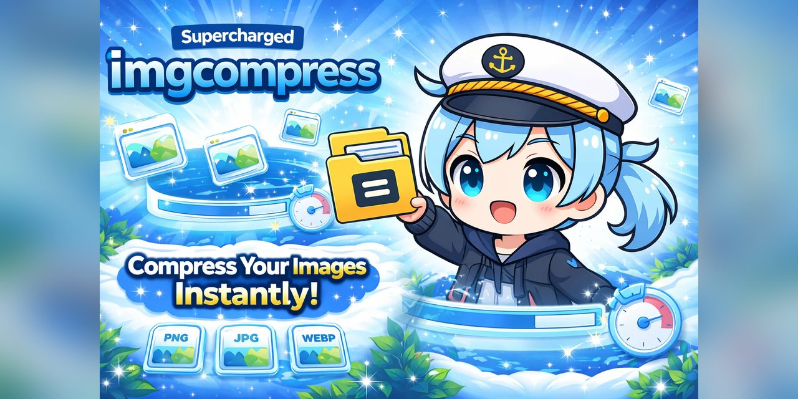
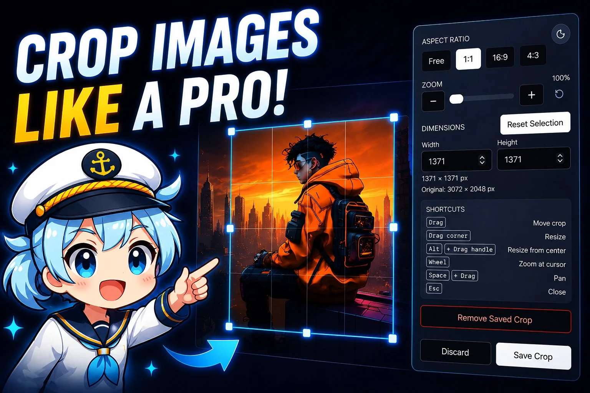

<div align="center">
  
  <h1>ImgCompress</h1>
  <p><strong>Every image format. Zero cloud.</strong></p>
  <p>Convert 70+ formats, crop per file, compress in bulk, and remove backgrounds with local AI. UI in 12 languages.<br/>Everything runs inside your container, so your files never leave your server.</p>

  <p>
    <a href="https://imgcompress.karimzouine.com/">
      
    </a>
    <a href="https://imgcompress.karimzouine.com/docs/installation">
      
    </a>
  </p>

  <p>
    <a href="https://hub.docker.com/r/karimz1/imgcompress">
      
    </a>
    <a href="https://github.com/karimz1/imgcompress">
      
    </a>
    <a href="./TRANSLATIONS.md">
      
    </a>
  </p>
  
<p><strong>Featured &amp; Listed on</strong></p>

 <p>
  <a href="https://github.com/awesome-selfhosted/awesome-selfhosted#readme">
    
  </a>
  <a href="https://coolify.io/docs/services/imgcompress?utm_source=github.com">
    
  </a>
  <a href="https://alternativeto.net/software/imgcompress/about">
    
  </a>
  <a href="https://selfhostedworld.com/software/imgcompress">
    
  </a>
  <a href="https://www.pitchhut.com/project/imgcompress-toolbox">
    
  </a>

</p>

---

  <p>
    <a href="https://buymeacoffee.com/karimz1">
      
    </a>
  </p>

  <p>
    <a href="https://imgcompress.karimzouine.com/">Website</a> ·
    <a href="https://imgcompress.karimzouine.com/docs">Docs</a> ·
    <a href="https://imgcompress.karimzouine.com/docs/installation">Installation Guide</a> ·
    <a href="https://hub.docker.com/r/karimz1/imgcompress">Docker Hub</a> ·
    <a href="https://github.com/karimz1/imgcompress/issues">Issues</a>
  </p>

  <br />

  
</div>

---

## What is ImgCompress?

ImgCompress is a **self-hosted image processing server** that runs entirely inside a single Docker container. It handles compression, format conversion, and AI-powered background removal, all locally on your own hardware. No cloud APIs, no third-party uploads, no tracking.

Built for people, homelab enthusiasts, and anyone who values privacy and owns their data.

---

## Features

| Feature | Details |
|---|---|
| **70+ Image Formats** | HEIC, HEIF, PSD, AVIF, EPS, PDF, WebP, TIFF, BMP, GIF, and 60+ more |
| **Local AI Background Removal** | Bundled model runs on your CPU. No API key, no subscription, no upload |
| **Local AI Upscaling** | Choose General or Anime. Real-ESRGAN enlarges images 2x, 4x, 8x, or to Full HD / 4K / 6K / 8K / 16K on your CPU, preserving the aspect ratio. Both models ship in the image; nothing is downloaded at runtime |
| **Fit to Exact Size** | GitHub social preview (1280 × 640), Open Graph (1200 × 630), or any size. A dedicated editor tab with automatic previews, an adjustable crop, or a blurred background |
| **Bulk Compression** | Multi-core parallel processing across entire photo libraries |
| **Format Conversion** | HEIC to WebP, PSD to JPG, image batches to paginated PDF, and more |
| **Per-File Cropping** | Crop each upload before conversion with ratio presets (Free, 1:1, 16:9, 4:3) or custom pixel dimensions |
| **Web UI + CLI** | Browser dashboard for day-to-day use; CLI for scripting pipelines |
| **Single Container** | Every codec and library pre-bundled, zero host dependencies |
| **Air-Gap Ready** | Once pulled, runs fully offline. No internet required, ever |

---

## AI Background Removal: Local & Private

Stop uploading personal or client photos to cloud-based removers. ImgCompress ships a bundled AI model that runs background removal **on your own hardware**. No API call, no subscription, no file ever leaves your server.

| Original | Background Removed |
|:---:|:---:|
|  |  |

---

## AI Upscaling (since v1.0.0)

Enlarge images with local AI while preserving their aspect ratio. Choose **General** (`realesr-general-x4v3`) for photos and mixed content, or **Anime** (`realesr-animevideov3`) for drawn images. Both models run on the CPU and work offline.

| Original | AI-upscaled |
|:---:|:---:|
|  |  |
|  |  |

Both rows start from a small image (about 120 px wide) taken to 4x. Left is a normal bicubic resize, right is the General model in ImgCompress.

---

## Fit to Exact Size (since v1.0.0)

Open the **Crop & resize** editor and select the **Fit to size** tab to create images at exact pixel dimensions for **GitHub social previews (1280 × 640)**, **Open Graph link previews (1200 × 630)**, or a custom size. A preview appears automatically and updates when you change the size or mode:

- **Crop to fill:** Places a visible crop box automatically, looking for text, faces, and other detail. Move or resize the box to adjust the result; the output preview updates with your selection.
- **Blurred background:** Keeps the whole image and fills the empty space with a blurred, slightly darker copy.

### Demo: one original, two GitHub social previews

Both examples below use the same **1536 × 1024** original and produce a **1280 × 640** preview.

<p align="center">
  <br/>
  <strong>Original · 1536 × 1024</strong>
</p>

| Crop to fill · 1280 × 640 | Blurred background · 1280 × 640 |
|:---:|:---:|
|  |  |
| **Auto fit** preserves the title, main message, and mascot's face while trimming surrounding artwork. | The whole image stays visible, including the format icons. A blurred copy fills the sides. |

### How to use it

1. Upload your image and choose an image output format.
2. Click **Crop & resize** on the file.
3. Open **Fit to size** and select **GitHub social preview (1280 × 640)**, **Open Graph link preview (1200 × 630)**, or **Custom size**, then choose **Crop to fill** or **Blurred background**.
4. Inspect the automatic preview. Move or resize the crop box if needed; **Adjust crop** also offers pixel dimensions. After a manual adjustment, **Auto fit** resets the framing.
5. Click **Save**, then convert and download. The saved selection and output size are used during conversion.

Previews are at most 2048 px per side. For bigger sizes the editor shows the preview size next to the export size, for example *Preview 2048 × 1152 px · exports at full size 4096 × 2304 px*. The download is always full size.

For a batch, **Auto fit all images** prepares a separate automatic result for every file using the selected size and mode. Open any file's editor to review or adjust it before converting.

Use the **Crop** tab for a manual crop without a fixed output size. Switching tabs keeps both drafts while the editor is open; **Save** applies the active tab. Saved fits reopen in **Fit to size** with their framing intact.

---

## Per-File Cropping (since v0.7.0)

Every upload gets its own crop overlay before conversion. Pick a ratio preset (Free, 1:1, 16:9, 4:3) or type exact pixel width and height. Selections are saved per file, so one batch can mix square thumbnails with 16:9 covers without re-uploading.



### How to use it

1. Drop your images into the upload area as usual.
2. On any file row, click the crop icon to open the editor.
3. Pick an aspect ratio preset (1:1, 4:3, 16:9, …) or set width and height manually.
4. Zoom and crop to frame the shot exactly the way you want it.
5. Click **Save** to keep the crop, **Discard** to back out, or **Remove** to clear a previously saved crop.
6. Convert as normal. The crop is applied first, then your chosen format, quality, resize, and background-removal settings.

> [!NOTE]
> **Server-rendered formats:** Some formats (e.g. PSD, EPS) are rendered server-side into a crop-friendly bitmap so you can still crop them in the browser.

Full walkthrough and demo video: **[Image Crop Editor docs](https://imgcompress.karimzouine.com/docs/web-ui#image-crop-editor)**.

---

## Quick Start

Pull the image, open `localhost:3001`, start converting. About 60 seconds total.

```bash
docker run -d \
  --name imgcompress \
  -p 3001:5000 \
  karimz1/imgcompress:latest
```

Prefer Docker Compose? Ready-made configurations live in [`docker/compose/`](docker/compose/):

- **[advanced.docker-compose.yaml](docker/compose/advanced.docker-compose.yaml)** for home or LAN use. Reachable from any device on your network out of the box, with container best practices applied (log rotation, healthcheck, no-new-privileges).
- **[proxied.docker-compose.yaml](docker/compose/proxied.docker-compose.yaml)** for hosting under a domain with HTTPS, behind a Traefik reverse proxy with TLS, security headers, and optional Let's Encrypt.

Step-by-step instructions for both are in the **[compose guide](docker/compose/README.md)**.

For environment variables and deploying without the mascot, see the **[full installation guide](https://imgcompress.karimzouine.com/docs/installation)**.

---

## Why I Built ImgCompress

I was tired of the "software loop." Every time I needed something simple, I had to install another app:

- **PSD files**: Needed specialized software just to convert them to an image file.
- **HEIC files**: Needed another converter for regular photo files.
- **Image to PDF**: Needed another app just to share a screenshot for work, since a PDF is often better for emails and easy for others to print.
- **AI Backgrounds**: I realized I needed one more app for that too.

I thought to myself: "Why can't one tool just do it all?" Plus, uploading personal photos to random online converters never felt right to me.

### One Toolbox for Everything

So I built a single toolbox that can take over **70 different formats** and fix them all in one place. Whether you need to convert PSD or HEIC files to an image, turn a screenshot into a PDF for a work email, or shrink a massive 4K photo, this tool does it automatically.

The community has now pulled the image tens of thousands of times, which shows the pain is real.

### Why Docker?

I chose Docker because it keeps your computer clean. Instead of you having to install 70 different messy libraries on your system, I packed everything into one **Ready-to-go Box** that you can run anywhere called **imgcompress**. It just works.

---

## Privacy by Design

| | |
|---|---|
| **No cloud processing** | Conversions, compression, and AI inference all run locally. Images never leave your machine. |
| **No telemetry** | No analytics, no crash reporting, no feature flags phoning home. Completely silent on the network after startup. |
| **Offline after pull** | Once the image is pulled, no internet connection is ever needed again. No license checks, no expiry. |
| **Open source** | GPL-3.0. Audit the code, fork it, self-host it forever. |

---

## Security-Hardened Docker Image

ImgCompress is built with a security-hardened, minimal image, aligned with common container security standards out of the box.

| | |
|---|---|
| **Minimal Surface** | No shell (`bash`, `sh`), no network tools (`curl`, `wget`, etc.), no package manager. The attack surface is drastically reduced. |
| **Minimal Components** | System dependencies are aggressively pruned to maintain a minimal runtime environment. |
| **Non-root User** | Runs as a non-root user `nonroot` by default. |
| **DHI Base Images** | Using Docker Hardened Images from the official [DHI](https://www.docker.com/products/hardened-images/) project for build phases and runtime Image. |
| **SBOM and Provenance** | The Docker Image is built with a full Software Bill of Materials (SBOM) and build provenance attestation. |

<div **align**="right">
  <a href="https://github.com/AlexanderSlokov">
    
  </a>
</div>

---

## Multilingual Support

ImgCompress supports multiple frontend languages and welcomes community improvements to every locale. See the **[translation guide](TRANSLATIONS.md)** to add a new language, improve an existing translation, or get credited for meaningful language updates.

Supported languages:

- English
- Spanish
- Spanish (Mexico)
- Chinese (Simplified)
- Hindi
- Arabic
- French
- Portuguese (Brazil)
- Russian
- Japanese
- German
- Hungarian

<div **align**="right">
  <a href="https://github.com/karimz1/imgcompress/issues/653">
    
  </a>
</div>

---

## Featured On

ImgCompress is recognized by the self-hosted community and is part of curated lists and platforms that self-hosters already rely on:

- **[Awesome Self-Hosted](https://github.com/awesome-selfhosted/awesome-selfhosted#readme)** [](https://github.com/awesome-selfhosted/awesome-selfhosted): community-curated index of self-hosted software, listed alongside the tools self-hosters already run in production. [Jump to the imgcompress entry](https://awesome-selfhosted.net/index.html#imgcompress).
- **[Coolify](https://github.com/coollabsio/coolify)** [](https://github.com/coollabsio/coolify): open-source, self-hostable deployment platform. ImgCompress is available as an **official Coolify service**, so you can add it to your stack straight from the Coolify dashboard. [Jump to the imgcompress entry](https://coolify.io/docs/services/imgcompress?utm_source=github.com).

> Know another platform that features ImgCompress, or want to add it to one? [Get in touch](https://www.karimzouine.com/#contact). Big thanks to the open-source community for getting ImgCompress noticed in the first place.

---

## Documentation

- [Installation & Configuration](https://imgcompress.karimzouine.com/docs/installation): Docker setup, environment variables, reverse proxy examples
- [Developer Guide](https://imgcompress.karimzouine.com/docs/developers): VS Code Dev Containers, architecture overview, local env setup
- [imgcompress-chan (Bot)](https://imgcompress.karimzouine.com/docs/imgcompress-chan): Custom helper bot that repairs Dependabot pnpm lockfiles and auto-merges dependency PRs
- [E2E Testing with Playwright](https://imgcompress.karimzouine.com/docs/e2e): How offline stability is verified across all 70+ formats
- [Credits & Libraries](https://imgcompress.karimzouine.com/docs/credits): The open source projects that power ImgCompress
- [Hall of Fame](https://imgcompress.karimzouine.com/docs/hall-of-fame): Sponsors and contributors

---

## Contributing

Contributions are welcome: bug reports, format requests, or pull requests.

> [!TIP]
> **New contributor?** The project ships a **VS Code Dev Container** with all 70+ image libraries and the AI environment pre-configured. Working local setup in under a minute. See the [Developer Guide](https://imgcompress.karimzouine.com/docs/developers).

- Read the **[Contributing Guide](contributing.md)** before opening a PR
- Browse [`good-first-issue`](https://github.com/karimz1/imgcompress/labels/good-first-issue) labels for a starting point
- Every change is verified by a Playwright E2E suite that covers all supported formats

> [!NOTE]
> **Meet [imgcompress-chan](https://imgcompress.karimzouine.com/docs/imgcompress-chan)**, the repo's custom helper bot. She auto-merges Dependabot PRs once CI passes, and if a frontend dependency update leaves a broken `pnpm-lock.yaml`.
---

## License & Author

**Author**: [Karim Zouine](https://www.karimzouine.com)  
**License**: [GPL-3.0](LICENSE)  
**Docker Image**: [hub.docker.com/r/karimz1/imgcompress](https://hub.docker.com/r/karimz1/imgcompress)

If ImgCompress saves you time, a GitHub star helps others discover it.
