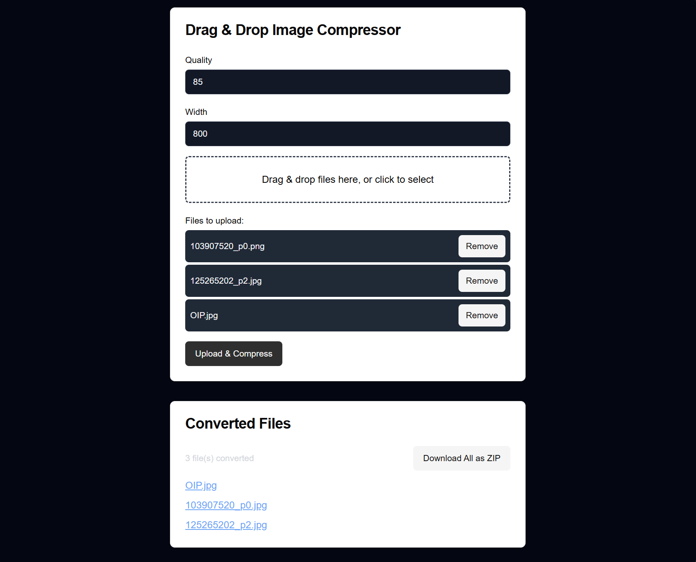

# imgcompress: Image Compression Tool


[](https://github.com/karimz1/imgcompress/actions/workflows/deploy.yml)


## **What is imgcompress?**

`imgcompress` is a lightweight, fully Dockerized tool for compressing, resizing, and converting images. It’s designed to simplify image optimization with:

- **HEIC to JPG Conversion**: Automatically convert HEIC files to JPG.
- **Batch & Single File Processing**: Process entire directories or individual images effortlessly.
- **Logging Options**: Choose between human-readable text or structured JSON output.
- **Seamless Automation**: Perfect for use in CI/CD pipelines or standalone workflows.
- **NEW Modern Web UI**: An intuitive web interface for easy image compression without the command line.

------

## **Installation**

Pull the latest image with:

```bash
docker pull karimz1/imgcompress:latest
```

------

## Usage

`imgcompress` provides both a Command-Line Interface (CLI) for advanced users and a Web User Interface (Web UI) for an intuitive, no-code experience.


### NEW: Web User Interface (Web UI) - Workflow

> This is the recommended approach because providing a user interface for image compression can be highly beneficial.

For users who prefer a graphical interface, `imgcompress` offers a modern Web UI.

#### **Starting the Web UI**

Run the following command to launch the Web UI:

```
docker run -p 5000:5000 karimz1/imgcompress:latest web
```

- Port Mapping:
  - `-p 5000:5000`: Maps port `5000` of the container to port `5000` on the host machine.

#### **Accessing the Web UI**

Once the container is running, open your browser and navigate to:

```
http://localhost:5000
```

#### **Features**

- **Drag & Drop**: Easily upload images for compression.
- **Batch Processing**: Handle multiple images simultaneously.
- **Real-Time Progress**: Monitor the compression status.
- **Download Optimized Images**: Retrieve compressed images directly from the Web interface.
- **Settings Panel**: Adjust compression quality and resizing options.
- **Multi Images Support**: Easily upload and process multiple images simultaneously, streamlining your workflow with the ability to drag and drop entire image folders.


#### Screenshoots
> The user interface may differ slightly from the screenshot, as I continuously develop and implement minor enhancements.

##### Web UI



### Command-Line Interface (CLI) - Workflow

> This approach is designed for advanced workflows and automation, allowing you to integrate it seamlessly into pipelines or other automated processes.

Navigate to your image directory and run:

#### Single File Processing:

```bash
docker run --rm \
  -v "$(pwd):/container/images" \
  -v "$(pwd)/converted:/container/converted" \
  karimz1/imgcompress:latest \
  /container/images/example.jpg /container/converted --quality 80 --width 1920
```

#### Folder Processing:

```bash
docker run --rm \
  -v "$(pwd):/container/images" \
  -v "$(pwd)/converted:/container/converted" \
  karimz1/imgcompress:latest \
  /container/images /container/converted --quality 85 --width 800
```

### **What It Does**

1. **Maps local directories:**
   - `$(pwd)`: Refers to the current working directory on your host machine.
   - `images/`: The input folder or file for uncompressed images.
   - `converted/`: The output folder for compressed images.
2. **Processes images:**
   - `--quality`: Sets JPEG quality (e.g., `80` for single file, `85` for folders).
   - `--width`: Resizes images to a specific width while maintaining aspect ratio.

------

### **Parameters**

| Parameter       | Description                                          |
| --------------- | ---------------------------------------------------- |
| `--quality`     | Compression quality (1–100, default: `85`).          |
| `--width`       | Resize images to the specified width (optional).     |
| `--debug`       | Enable detailed logs for troubleshooting.            |
| `--json-output` | Output logs in JSON format for automation workflows. |

------

### **Example Logs**

#### **Text Logs**:

```plaintext
Starting image conversion process.
Processing directory: /container/input_folder/
Converted: /container/input_folder/pexels-willianjusten-29944187.jpg -> /container/output_folder/pexels-willianjusten-29944187.jpg (Q=80, W=800)
Converted: /container/input_folder/test_image.png -> /container/output_folder/test_image.jpg (Q=80, W=800)
Converted: /container/input_folder/pexels-pealdesign-28594392.jpg -> /container/output_folder/pexels-pealdesign-28594392.jpg (Q=80, W=800)
Summary: 3 file(s) processed, 0 error(s).
```

#### **JSON Logs**:

```json
{
    "status": "complete",
    "conversion_results": {
        "files": [
            {
                "file": "pexels-willianjusten-29944187.jpg",
                "source": "/container/input_folder/pexels-willianjusten-29944187.jpg",
                "destination": "/container/output_folder/pexels-willianjusten-29944187.jpg",
                "original_width": 3648,
                "resized_width": 800,
                "is_successful": true,
                "error": null
            },
            {
                "file": "test_image.png",
                "source": "/container/input_folder/test_image.png",
                "destination": "/container/output_folder/test_image.jpg",
                "original_width": 6000,
                "resized_width": 800,
                "is_successful": true,
                "error": null
            },
            {
                "file": "pexels-pealdesign-28594392.jpg",
                "source": "/container/input_folder/pexels-pealdesign-28594392.jpg",
                "destination": "/container/output_folder/pexels-pealdesign-28594392.jpg",
                "original_width": 3486,
                "resized_width": 800,
                "is_successful": true,
                "error": null
            }
        ],
        "file_processing_summary": {
            "total_files_count": 3,
            "successful_files_count": 3,
            "failed_files_count": 0
        }
    }
}
```

------

## **Advanced Use Cases**

- **HEIC Conversion**: Just include HEIC files in your input directory, and they’ll automatically convert to JPG.
- **CI/CD Integration**: Use `--json-output` for structured results in automated workflows.

------

## **Help Menu**

For all options, run:

```bash
docker run --rm karimz1/imgcompress --help
```

------

## **Contribution**

[Source Code](https://github.com/karimz1/imgcompress)

I welcome contributions! Fork the repo, create a branch, and submit a pull request.

------


## ❤️ Supporting the Project ❤️

If you find this project useful, please consider supporting its development. Donations are appreciated and help maintain and improve this tool. 

**PayPal:** [mails.karimzouine@gmail.com](mailto:mails.karimzouine@gmail.com)

------

## License

This project is licensed under the MIT License. See the [LICENSE](./LICENSE) file for details.