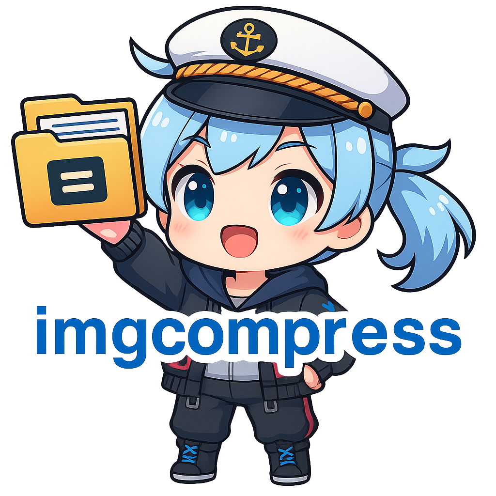

# ImgCompress: Privacy-First Image Optimizer
## Local Image Compression, Format Conversion & AI Background Removal (Docker)

**ImgCompress** is a high-performance, **self-hosted Docker image compression and conversion tool** featuring fully local AI-powered background removal. Process unlimited images offline with **zero cloud uploads**, no subscriptions, and complete data sovereignty.

## Why choose ImgCompress?

**ImgCompress** was developed as a private alternative to cloud-based converters. Most web tools force a choice between convenience and privacy. ImgCompress is a **complete local-first image web tool** that handles everything from batch resizing to professional AI background removal on local hardware.

### Privacy by Design (Compliance-Friendly)

Unlike traditional SaaS services, ImgCompress is built around a strict **“Privacy by Default”** philosophy. All image processing happens entirely on your own hardware, making it suitable for handling sensitive or regulated data without relying on external services.

- **100% Local Processing:** All operations run exclusively on your CPU/GPU.
- **No External API Calls:** Images are never uploaded, proxied, or shared with third-party servers.
- **Air-Gapped Ready:** Fully functional in offline and restricted network environments.

[Get Started with Installation :octicons-arrow-right-24:](installation.md){ .md-button .md-button--primary }

---

## AI Demo
| Original Image | Background Removed (Local AI) |
|----------------|-------------------------------|
| { width="400" } | { width="400" } |

## Advanced Image Processing Features

- **HEIC/HEIF to JPG Converter**: Instantly convert iPhone photos into high-quality JPEG or PNG.
- **Local AI Background Removal**: 100% offline background removal.
- **PDF to Image Tool**: Extract PDF pages as individual high-resolution images (PNG/JPG).
- **Universal Format Support**: Convert between 70+ formats including **WebP, PSD, EPS, and TIFF**.
- **Professional Compression Controls**: Fine-tune quality settings, dimensions, and lossless optimization.
- **Multi-Core Parallel Processing**: Optimized for lightning-fast batch jobs.
- **Automation Friendly**: Scriptable CLI with JSON output for DevOps and CI/CD pipelines.

## Business & Personal Use Cases

- **Web Developers**: Optimize website assets to improve **Google PageSpeed** scores.
- **Photographers**: Batch compress high-res galleries by up to 80% without visible quality loss.
- **Privacy-Conscious Users**: Securely process family photos and sensitive documents.
- **Enterprises**: Maintain **GDPR, HIPAA, or SOC2 compliance** by processing all media in-house.

