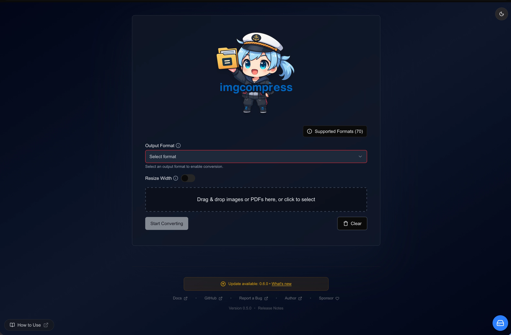

# Release Notes

This document tracks all notable changes I've made to **ImgCompress**, including new features, bug fixes, and performance optimizations.

---

## Maintenance and Upgrades

To ensure you have the latest features and security patches, I recommend keeping your installation up to date. 

* **Current History:** Review the [Change Log](#change-log) below.
* **How to Update:** Follow my [**Update Guide**](installation.md#maintenance-updates) to pull the latest Docker image.

---

## Transparent Update Checks

ImgCompress is **100% open source**. I believe in complete transparency regarding how this software interacts with the internet. To ensure you never miss an important fix, I included a privacy-safe update check in the Web UI:

### How it works
1.  **Local Version:** The app identifies its current version from the local `release-notes.md`.
2.  **GitHub Check:** The UI makes a single, secure request to the [GitHub Releases API](https://api.github.com/repos/karimz1/imgcompress/releases/latest).
3.  **Comparison:** If the GitHub version is newer than your local version, an update banner appears in your dashboard.

!!! success "Privacy First"
    - This process is **anonymous and read-only**.
    - **Pure Comparison:** The check only compares two version strings (e.g., `v0.4.0` vs `v0.5.0`).

### What the update notification looks like

{ .glightbox width="3160" height="2072" style="width: 520px; height: auto;" }

---

## Change Log

!!! tip "Transparency"
    You can verify every code change I make directly on the [GitHub Repository](https://github.com/karimz1/imgcompress).

--8<-- "frontend/public/release-notes.md"
