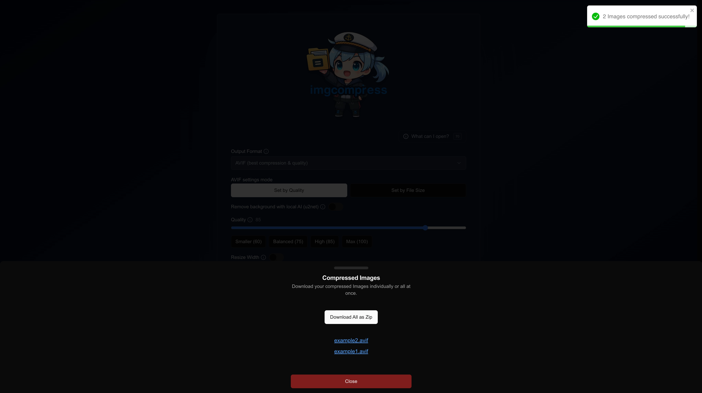
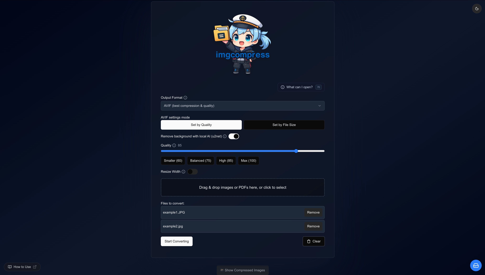
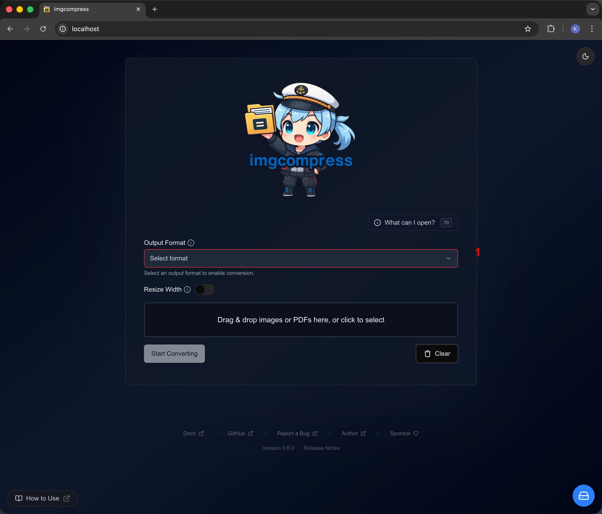
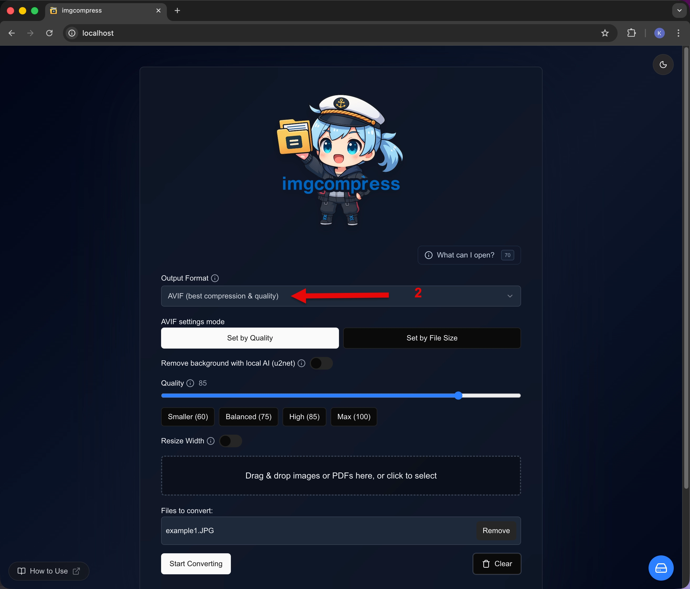
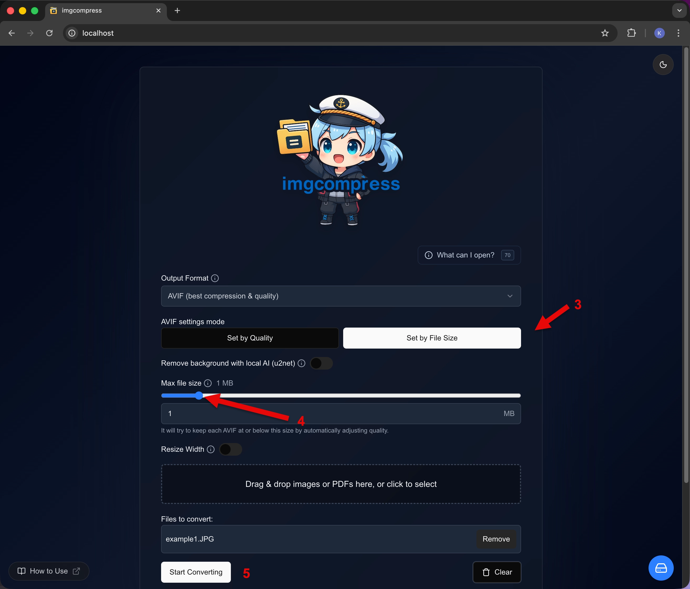

# Playing with the Web UI

Using **imgcompress** is easy. There are no complicated buttons to break. 

Make sure you have [set it up](installation.md) first.

## Quick 3-Step Guide

| Step | How it looks | What to do |
|-----:|------------|-------------|
| **1** | { .glightbox width="240" height="auto" } | **Drop your photos** Drag images into the box. Tell it if you want them smaller or in a new format. |
| **2** | { .glightbox width="240" height="auto" } | **Wait for the magic** Watch the progress bars fill up. All the work happens on your computer. |
| **3** | { .glightbox width="240" height="auto" } | **Get your new images** Save your fresh, tiny images one by one or get them all together in a ZIP file. |

---

## Fun with Backgrounds (Making Stickers)

Want to take the background out of a photo? It is like magic.

!!! note "Important Tip"
    To remove backgrounds, make sure you choose **AVIF** or **PNG** as your output format. These formats are great at keeping backgrounds invisible.

| Step | How it looks | What to do |
|-----:|------------|-------------|
| **1** | { .glightbox width="240" height="auto" } | **Flip the switch** Pick **AVIF** or **PNG**, then flip the "Remove Background" switch. |

### See the Magic AI Background Removal
Look how it takes the sky and hills away from this sunset:

| Original Photo | Just the Sunset |
|----------------|-------------------------------|
| { width="400" height="auto" } | { width="400" height="auto" } |

---

## Meeting a specific size

Need your image to be exactly 1MB for a website? **imgcompress** can help. 

| Step | How it looks | What to do |
|-----:|------------|-------------|
| **1** | { .glightbox width="240" height="auto" } | **Pick a format** Choose **JPG** or **AVIF** so the tool knows how to calculate the size. |
| **2** | { .glightbox width="240" height="auto" } | **Add your photos** Drag your images into the queue. |
| **3** | { .glightbox width="240" height="auto" } | **Set your limit** Open the "Set by File Size" section, pick your target (like 1 MB), and click convert. |

---

## Privacy & Safety
**imgcompress** is designed to be 100% private. All your images stay on your computer. To learn more about how I keep your data safe, check out the [**Privacy & Network Safety**](privacy.md) page.
