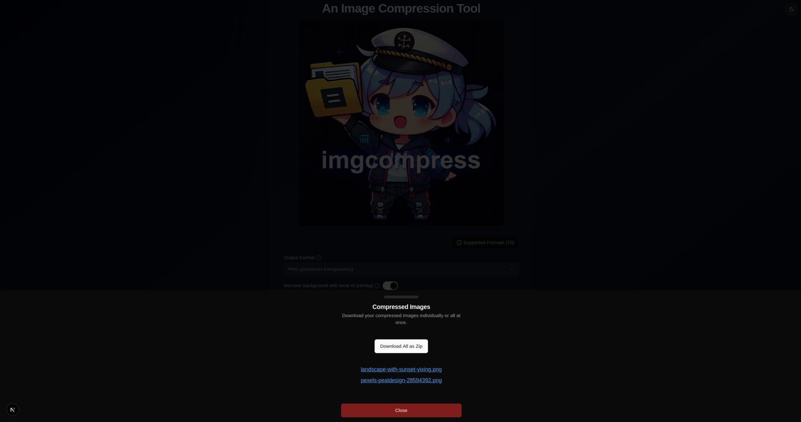
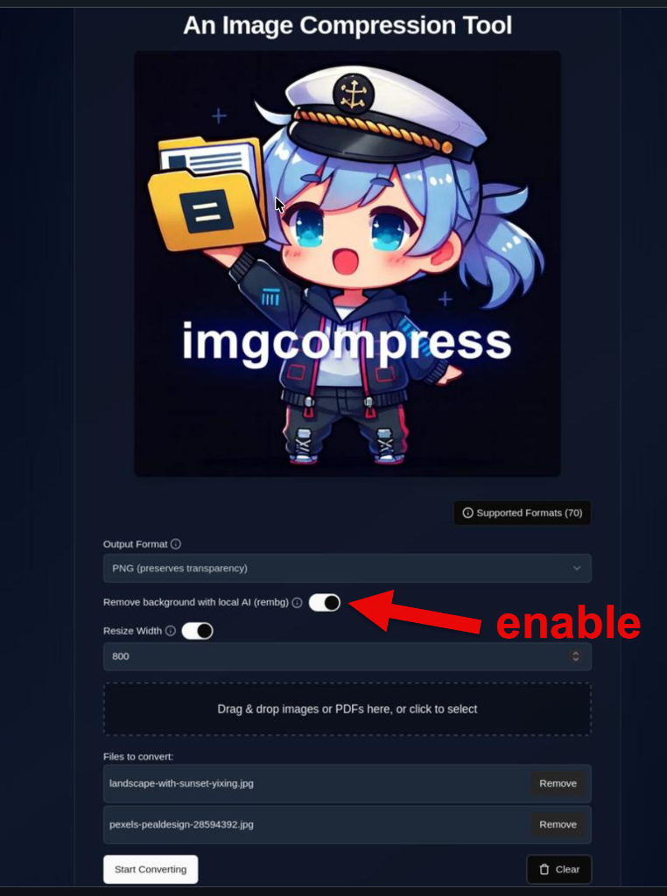
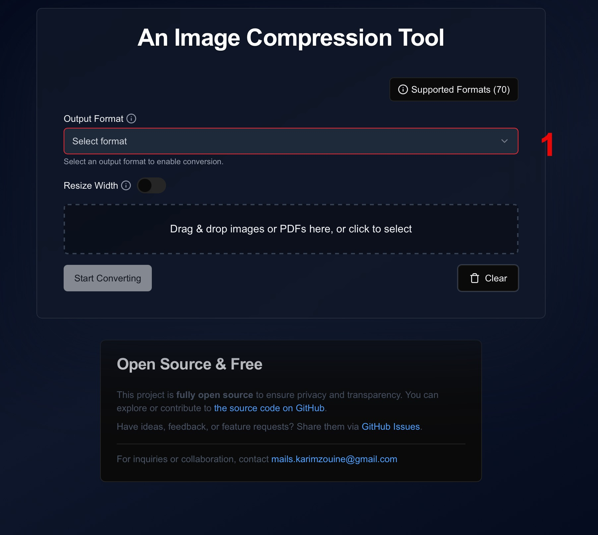
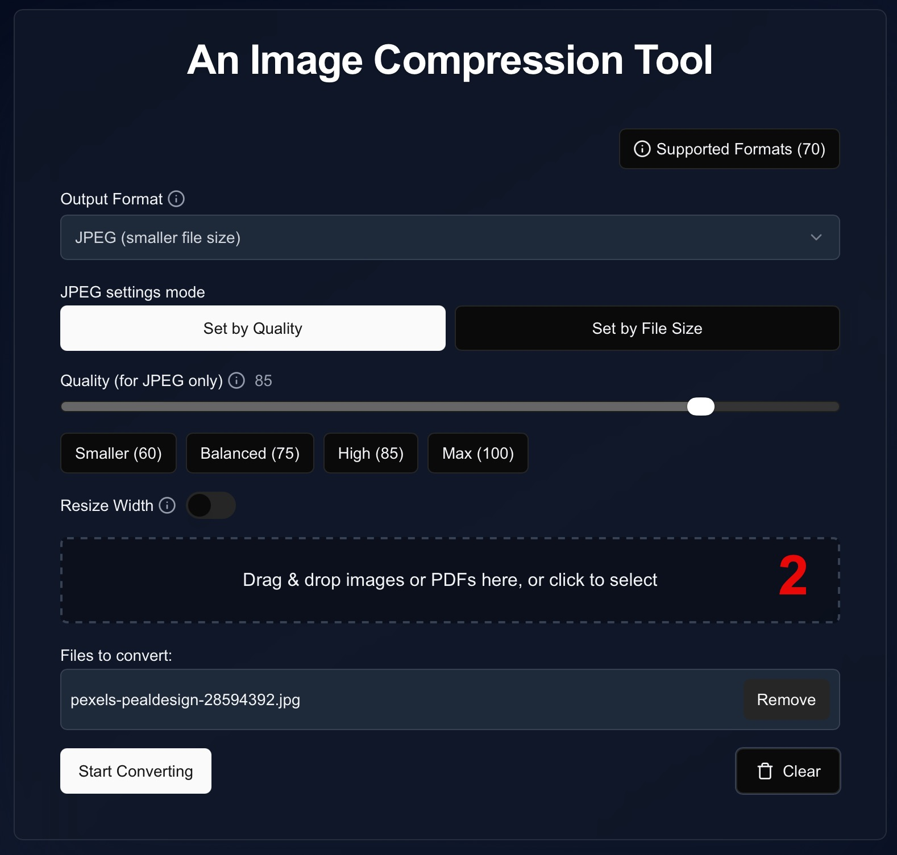
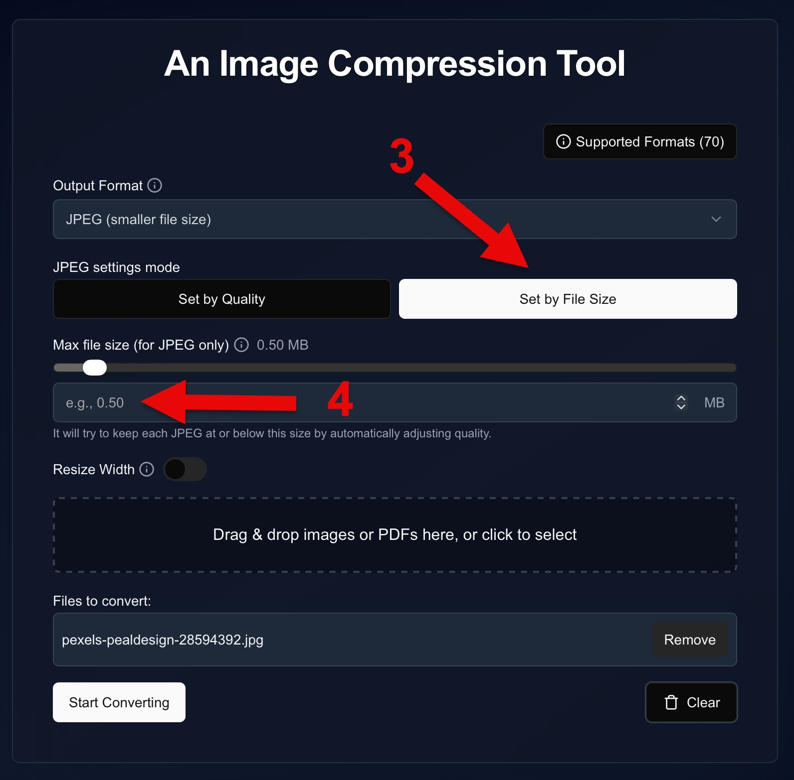
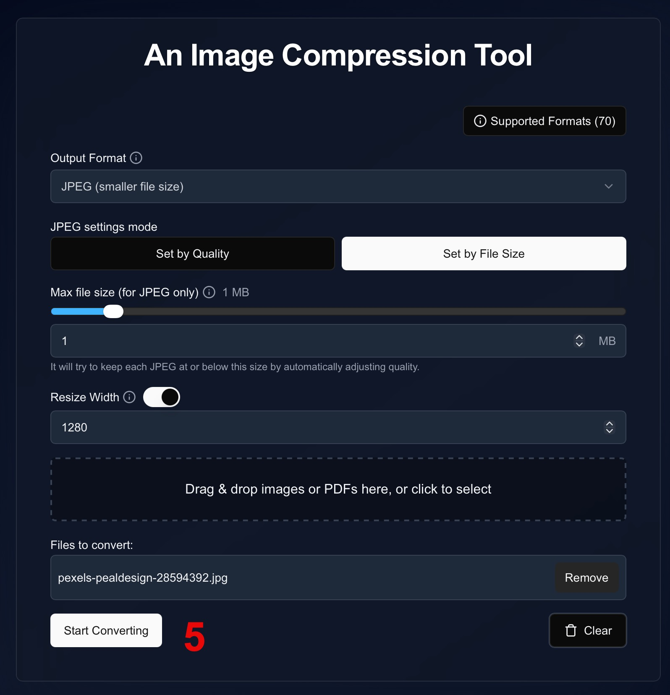
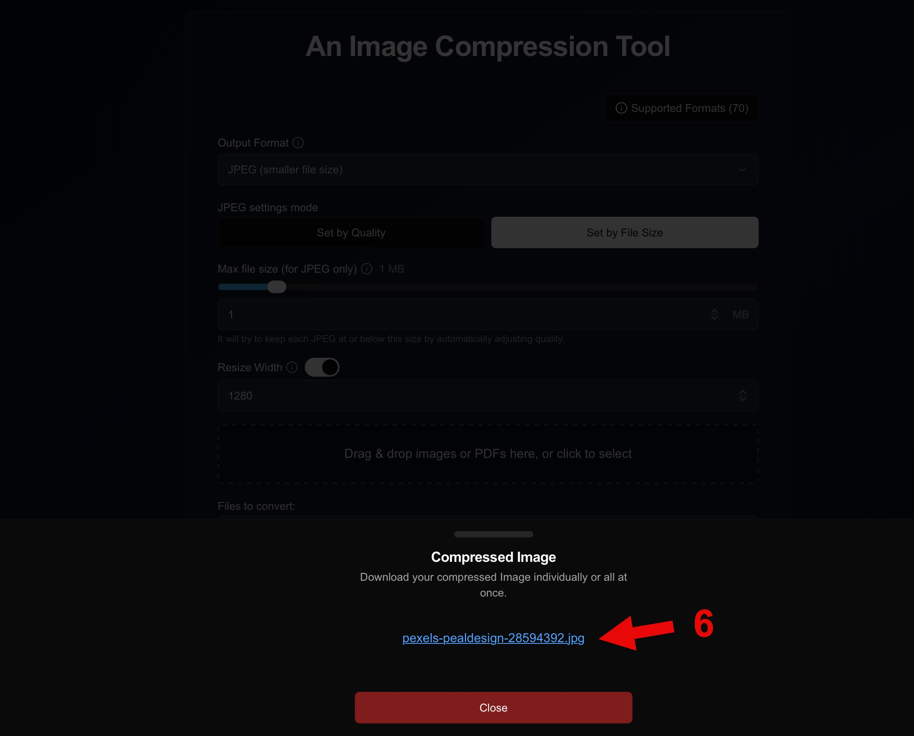

# How to Use the Web UI

!!! important
    Before you begin, make sure you have [installed imgcompress](installation.md). This setup is required to access the Web UI.

The Web UI is the primary way to interact with imgcompress. It provides a user-friendly interface for uploading, configuring, and processing images.

## ✨ Features

*   **Drag & Drop**: Upload images or PDF files directly.
*   **Live Progress**: Watch the compression in real-time.
*   **Bulk Processing**: Handle hundreds of images at once.
*   **ZIP Download**: Get all your optimized images in a single archive.
*   **Modern Formats**: Full support for **AVIF** a modern format that combines high compression with transparency support.

## 📁 Supported Output Formats

Choose the best format for your needs directly from the settings menu:

| Format | Transparency | Best Use Case |
|:---:|:---:|---|
| **AVIF** | ✅ Yes | **Recommended.** Modern format with superior compression. Much smaller than JPEG/PNG while keeping high quality. |
| **PNG** | ✅ Yes | Best for images where pixel-perfect lossless quality is required. |
| **JPEG** | ❌ No | Ideal for standard web photos where transparency is not needed. |
| **ICO** | ✅ Yes | Used specifically for website favicons and app icons. |

## 🚀 Usage Steps

| Step | Screenshot | Description |
|-----:|------------|-------------|
| **1** | [{ .glightbox width="240" }](images/ui-example/1.jpg) | **Upload & Configure** Drag & drop images or PDFs, choose your format (JPEG, PNG, AVIF), and configure options. |
| **2** | [{ .glightbox width="240" }](images/ui-example/2.jpg) | **Processing** Images are processed locally with live progress feedback. |
| **3** | [{ .glightbox width="240" }](images/ui-example/3.jpg) | **Download Results** Download files individually or as a ZIP archive. |

## 🧠 Local AI Background Removal

Remove backgrounds instantly using the local AI model in imgcompress (powered using [rembg](https://github.com/danielgatis/rembg)).

!!! note "Supported Formats: PNG & AVIF"
    This feature requires an output format that supports transparency: **PNG** or **AVIF**.

!!! success "Pro Tip: Why use AVIF for Background Removal?"
    AVIF supports transparency just like PNG but with **superior compression**. This allows you to remove backgrounds and keep the resulting file size incredibly small without sacrificing quality.

| Step | Screenshot | Description |
|-----:|------------|-------------|
| **1** | [{ .glightbox width="240" }](images/enable_rembg.png) | **Toggle Background Removal** Select **PNG** or **AVIF** as the target format and toggle the **Remove Background** switch. |

| Original Image | Background Removed (Local AI) |
|----------------|-------------------------------|
| { width="400" } | { width="400" } |

> ℹ️ **Info**
>
> Processed fully locally using [rembg](https://github.com/danielgatis/rembg) and  
> [U2-Net](https://github.com/xuebinqin/U-2-Net) local AI model.  
> No data ever leaves your network.
>
> Internally it also uses [onnxruntime](https://github.com/microsoft/onnxruntime).  
> Imgcompress also uses [Pillow](https://github.com/python-pillow/Pillow) for re-serialization of images.

> 📸 **Source of Original Image**
> 
> [Landscape with sunset in Yixing (Freepik)](https://www.freepik.com/free-photo/landscape-with-sunset-yixing_1287284.htm), used for demonstration purposes.

## 🎯 Export Image by Target Specific Max Filesize

Need your image to be exactly under 500KB or 1MB? ImgCompress can calculate the required quality setting for you.

!!! tip "Now supports AVIF"
    The "Max Output Size" slider is available for both **JPEG** and **AVIF** formats. Since AVIF compresses better than JPEG, you can often fit a higher-quality image into the same file size limit.

| Step | Screenshot | Description |
|-----:|------------|-------------|
| **1** | [{ .glightbox width="240" }](images/tutorials/export_jgp_steeps_by_max_size/jpeg_imgcompress_steeps_by_max_size_5.jpg) | **Select Format** Choose **JPEG** or **AVIF** as the output format from the dropdown menu. |
| **2** | [{ .glightbox width="240" }](images/tutorials/export_jgp_steeps_by_max_size/jpeg_imgcompress_steeps_by_max_size_4.jpg) | **Upload Images** Drag and drop your images into the processing area or click to select them. |
| **3** | [{ .glightbox width="240" }](images/tutorials/export_jgp_steeps_by_max_size/jpeg_imgcompress_steeps_by_max_size_3.jpg) | **Configure Size** Switch to the **Set by File Size** tab and enter your desired maximum size (e.g., 0.5 MB). |
| **4** | [{ .glightbox width="240" }](images/tutorials/export_jgp_steeps_by_max_size/jpeg_imgcompress_steeps_by_max_size_2.jpg) | **Process** Click the **Start Converting** button to begin the compression process. |
| **5** | [{ .glightbox width="240" }](images/tutorials/export_jgp_steeps_by_max_size/jpeg_imgcompress_steeps_by_max_size_1.jpg) | **Download** Once finished, click the download link to save your optimized image. |