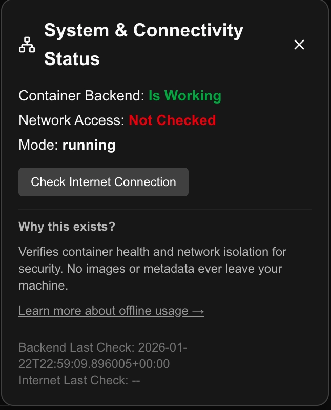
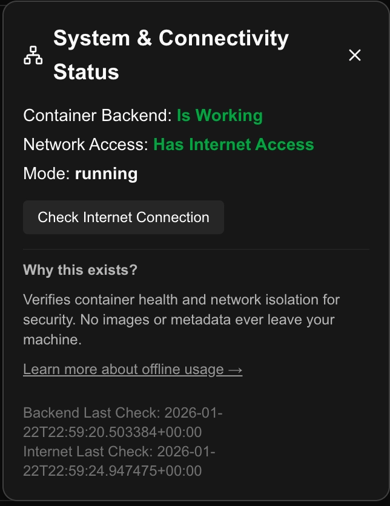
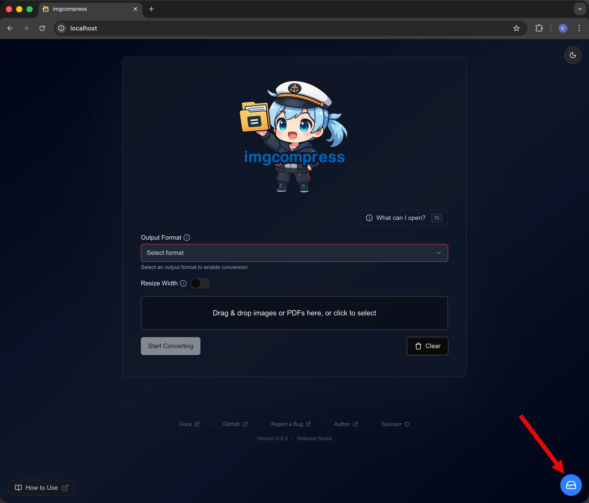
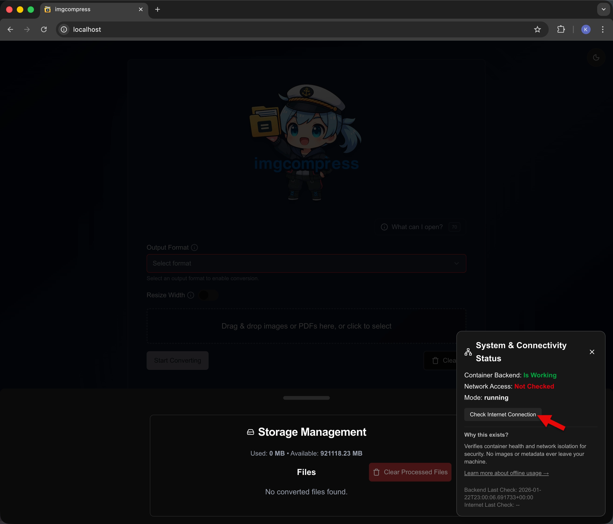

# Using the Web UI

!!! important
    Before you begin, ensure you have [installed imgcompress](installation.md). A local installation is required to run the Web UI.

## Quick Start Guide

| Step | Screenshot | Description |
|-----:|------------|-------------|
| **1** | { .glightbox width="4070" height="2304" style="width: 240px; height: auto;" } | **Upload & Configure** Drop images or PDFs into the queue, choose AVIF/JPEG/PNG, and set quality plus resize or size limits before running. |
| **2** | { .glightbox width="4090" height="2304" style="width: 240px; height: auto;" } | **Process Locally** Watch the queue update in real time while everything runs on your machine with no external requests. |
| **3** | { .glightbox width="4094" height="2300" style="width: 240px; height: auto;" } | **Download Results** Save finished files individually or export the entire batch as a ZIP once processing completes. |

The Web UI provides a powerful, privacy-focused way to compress images without the need for cloud-based tools.

## Key Features

*   **Drag & Drop**: Easy file management for images and PDFs.
*   **Real-time Feedback**: Monitor batch progress with live indicators.
*   **Bulk Processing**: Efficiently handle hundreds of images in one go.
*   **ZIP Export**: Download all processed images in an organized archive.
*   **Privacy First**: All processing happens on your local machine.

## Choosing the Right Format

Select the format that best fits your project's needs:

| Format | Transparency | Best Use Case |
|:---:|:---:|---|
| **AVIF** | ✅ Yes | **Recommended.** Next-gen compression that keeps quality high while drastically reducing file size. |
| **PNG** | ✅ Yes | Perfect for graphics and logos where pixel-perfect, lossless quality is essential. |
| **JPEG** | ❌ No | Universal standard for photos where transparency is not required. |
| **ICO** | ✅ Yes | Specifically designed for web favicons and desktop application icons. |

## Instant Background Removal

!!! note "Requires Transparency Support"
    To use this feature, ensure your output format is set to **AVIF** or **PNG**.

!!! success "Why use AVIF for Background Removal?"
    AVIF combines the transparency support of PNG with **superior compression**. It allows you to remove backgrounds and maintain a tiny footprint without compromising visual quality.

| Step | Screenshot | Description |
|-----:|------------|-------------|
| **1** | { .glightbox width="4062" height="2304" style="width: 240px; height: auto;" } | **Toggle Removal** Select **AVIF** or **PNG**, then enable **Remove Background** to process cutouts locally. |

### AI Demo

| Original Image | Background Removed (Local AI) |
|----------------|-------------------------------|
| { width="800" height="532" style="width: 400px; height: auto;" } | { width="800" height="532" style="width: 400px; height: auto;" } |

## Target Specific File Sizes

If you need to meet a strict file size limit (e.g., for web uploads), ImgCompress can automatically calculate the optimal quality for you.

!!! tip "AVIF Support"
    The **Max Output Size** slider works for both **JPEG** and **AVIF**. Since AVIF compresses more efficiently, you can often achieve higher visual quality within the same size limit.

| Step | Screenshot | Description |
|-----:|------------|-------------|
| **1** | { .glightbox width="2630" height="2244" style="width: 240px; height: auto;" } | **Choose Format** Pick **JPEG** or **AVIF** so the size calculator knows which codec to target. |
| **2** | { .glightbox width="2630" height="2244" style="width: 240px; height: auto;" } | **Add Files** Drag your images into the queue; they stay staged until you start converting. |
| **3** | { .glightbox width="2630" height="2244" style="width: 240px; height: auto;" } | **Set Max Size & Convert** Open **Set by File Size**, choose your MB limit (e.g., 1 MB), then start conversion to auto-tune quality to that cap. |

## High-Security & Offline Usage

`imgcompress` is engineered for air-gapped environments where data privacy and network isolation are critical requirements. This section explains how to verify and manage your deployment's connectivity status.

### Connectivity Monitoring & Verification

The Web UI includes a built-in **System & Connectivity Status** utility. This feature provides immediate visibility into the container's network posture, ensuring that isolation policies (if applied) are correctly enforced.

#### Monitoring Features
*   **Container Health**: Real-time validation that the core image processing engine is operational.
*   **Network Reachability**: A diagnostic check to confirm whether the container has outbound access to the public internet.

!!! important "Privacy Audit"
    All image processing is **100% local**. The connectivity check is a lightweight socket probe and **never** transmits images, metadata, or user data. It serves strictly as a visual verification tool.

### Status Indicators

The interface provides clear visual cues regarding your current network environment:

| Restricted / No Internet | Online / Internet Available |
| :--- | :--- |
| { width="646" height="800" } | { width="644" height="836" } |

## Network & Connectivity

The Web UI includes a manual **"Check Internet Connection"** button. I've designed this to be as lightweight and transparent as possible.

### How it works
When you click the button, the tool performs a basic reachability test:
1. **Target:** It attempts to open a socket connection to `1.1.1.1:53` (Cloudflare DNS).
2. **Action:** It simply checks if the connection can be established.
3. **Privacy:** No DNS queries are sent, and no data is transmitted. This is a pure "heartbeat" check to verify outbound access from within the Docker container.

!!! tip "Manual Reachability Only"
    This check is purely user-initiated. ImgCompress does not perform background pings for connectivity; the request only occurs when you manually click the button.

### How to Access the Connection Status

1.  Navigate to the **Storage Management** section:
    { width="2630" height="2244" }
2.  Click the **System & Connectivity Status** button:
    { width="2630" height="2244" }
3.  Review your **System and Network Status** overview:
    { width="2630" height="2244" }
